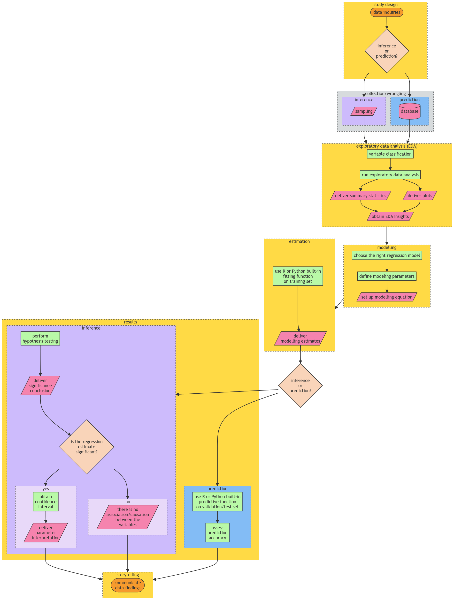
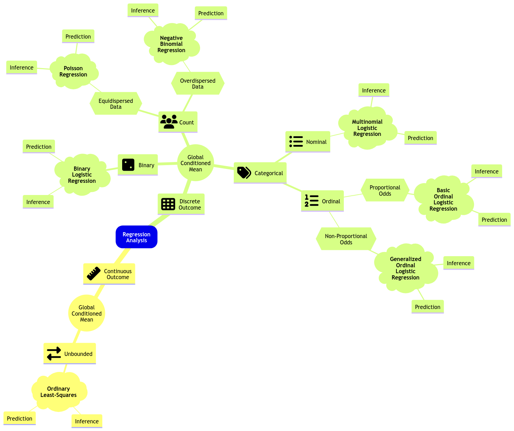

# Lecture 1: Generalized Linear Models

## Data Science Workflow

- General stages of the workflow:
  1. Study design
  2. Data collection and wrangling
  3. Exploratory data analysis (EDA)
  4. Data modeling
  5. Estimation
  6. Results
  7. Storytelling



From: https://pages.github.ubc.ca/MDS-2023-24/DSCI_562_regr-2_students/notes/lecture1-glm-link-functions-and-count-regression.html

- Choose a proper workflow according to either:
  - Inferential
  - Predictive
- Also choose correct regression model

## Review of Regression I

### Ordinary Least Squares (OLS) Regression

- Response of continuous nature (hence the "ordinary")
- Response is subject to **regressors** (or explanatory variables/ features/ independent variables)
  - More than 1 regressor => **multiple linear regression**

$$Response = Systematic + Random$$

$$Y_i = \beta_0 + \beta_1 g_1(x_{i1}) + \beta_2 g_2(x_{i2}) + \dots + \beta_p g_p(x_{ip}) + \epsilon_i$$

- random is the $\epsilon_i$ term

#### Assumptions

1. **Linearity**: the relationship between the response and functions of the regressors is linear
2. Errors are **independent** of each other and are **normally distributed** with mean 0 and variance $\sigma^2$

Hence, each $Y_i$ is assumed to be independent and normally distributed.

#### Estimation

- To fit will need $k+2$ parameters: $\beta_0, \beta_1, \dots, \beta_k, \sigma^2$
- Minimize the sum of squared errors (SSE) OR maximize the likelihood of the observed data

- **Maximum Likelihood Estimation (MLE)**: find the parameters that maximize the likelihood of the observed data
  - **Likelihood**: the probability of observing the data given the parameters
  - **Log-likelihood**: the log of the likelihood

#### Inference

- Do a t-test on the parameters to see if they are statistically significant

### Limitations of OLS

- OLS allows response to take any real number.
- Examples of non-suitable responses:
  - Non-negative values
  - Binary values (success/failure)
  - Count data

## Link Function

- Recall: OLS models a continuous response via its conditional mean

$$\mu_i = E(Y_i | X_i) = \beta_0 + \beta_1 g_1(x_{i1}) + \beta_2 g_2(x_{i2}) + \dots + \beta_p g_p(x_{ip}) $$

- **BUT** this is not suitable for non-continuous responses (e.g. binary, count, non-negative).
- **Solution**: use a **link function** $h(\mu_i)$ to map the conditional mean to the real line

</br>

- **Link function**: relate the systematic component, $\eta_i$, with the response’s mean

$$h(\mu_i) = \eta_i = \beta_0 + \beta_1 g_1(x_{i1}) + \beta_2 g_2(x_{i2}) + \dots + \beta_p g_p(x_{ip}) $$

- **Monotonic**: allows for a one-to-one mapping between the mean of the response variable and the linear predictor

$$\mu_i = h^{-1}(\eta_i)$$

- **Differentiable**: to allow for maximum likelihood estimation (MLE), used to obtain $\hat{\beta}$
  $$

## Generalized Linear Models (GLM)

- **Generalized Linear Models (GLM)**: a generalization of OLS regression that allows for non-continuous responses

**GLM** = **link function** + **error distribution**



## Poisson Regression

- **Poisson regression**: a GLM for count data (Equidispersed)

  - **Equidispersed**: the variance of the response is equal to its mean (i.e. $Var(Y_i) = E(Y_i) = \lambda_i$)

- It assumes a random sample of $n$ count observations $Y_i$s
  - Independent
  - Not Identically Distributed: Each $Y_i$ has its own mean $E(Y_i) = \lambda_i > 0$ and variance $Var(Y_i) = \lambda_i > 0$

$$Y_i \sim Poisson(\lambda_i)$$

- $\lambda_i$ is the risk of event occurance in a given timeframe or area (definition of Poisson distribution)

### Link Function for Poisson Regression

- **Log link function**: the log of the mean of the response variable is linearly related to the regressors

$$h(\mu_i) = log(\mu_i) = \eta_i = \beta_0 + \beta_1 X_{i1} + \beta_2 X_{i2} + \dots + \beta_p X_{ik} $$

Hence,

$$ \lambda*i = e^{\beta_0 + \beta_1 X*{i1} + \beta*2 X*{i2} + \dots + \beta*p X*{ik}} $$

- This is good since $\lambda_i$ (mean count) is always positive

### Poisson Regression in R

```r
glm(Y ~ X, family = poisson, data = dataset)

# view each regression coefficient
tidy(glm_model)
tidy(glm_model, conf.int = TRUE) # for 95% confidence interval

# view model summary
glance(glm_model)
```

#### Interpretation of Coeffs of Poisson Regression

e.g. $\beta_1 = 0.5$

- $\beta_1$ is the expected change in the log of the mean count for a one-unit increase in $X_1$ holding all other variables constant
- a one-unit increase in $X_1$ will increase the mean count by $e^{0.5} = 1.65$ times.

### Inference of Poisson Regression

- To determine the significance of the parameters $\beta_1, \beta_2, \dots, \beta_p$, we can do a **Wald statistic**

$$z_j = \frac{\hat{\beta_j}}{SE(\hat{\beta_j})}$$

- To test the hypothesis:
  - $H_0: \beta_j = 0$
  - $H_1: \beta_j \neq 0$

## Negative Binomial Regression

- **Negative Binomial Regression**: a GLM for count data (Overdispersed)

  - **Overdispersed**: the variance of the response is greater than its mean (i.e. $Var(Y_i) > E(Y_i) = \lambda_i$)

---

**Check for Overdispersion**

```r
dispersiontest(glm_model)
```

- if p-value < 0.05, then there is overdispersion (reject null hypothesis)

If use Poisson regression on overdispersed data, then the standard errors will be underestimated => **Type I error** (false positive) increases

---

- Recall PMF of **Negative Binomial Distribution**:

$$P(Y_i | m,p_i) = (^{y_i + m - 1}_{y_i}) p_i^{y_i} (1 - p_i)^m$$

- $y_i$ is the number of failures before experiencing $m$ successes where probability of success is $p_i$

$$E(Y_i) = \frac{m(1-p_i)}{p_i}$$

$$Var(Y_i) = \frac{m(1-p_i)}{p_i^2}$$

- Rearranging the above equations, we get:

$$E(Y_i) = \lambda_i$$

$$Var(Y_i) = \lambda_i (1 + \frac{\lambda_i}{m})$$

- Interesting information:

$$X \sim Poisson(\lambda) = lim_{m \to \infty} Negative Binomial(m, p_i)$$

### Negative Binomial Regression in R

```r
glm.nb(Y ~ X, data = dataset)
```

Since negative binomial has the same link function as Poisson, we can interpret the coefficients the same way.
