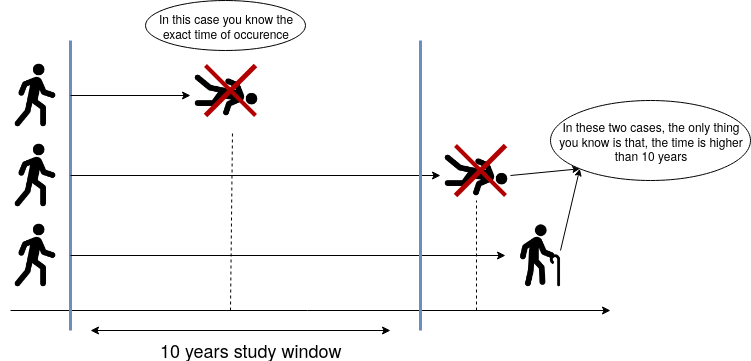
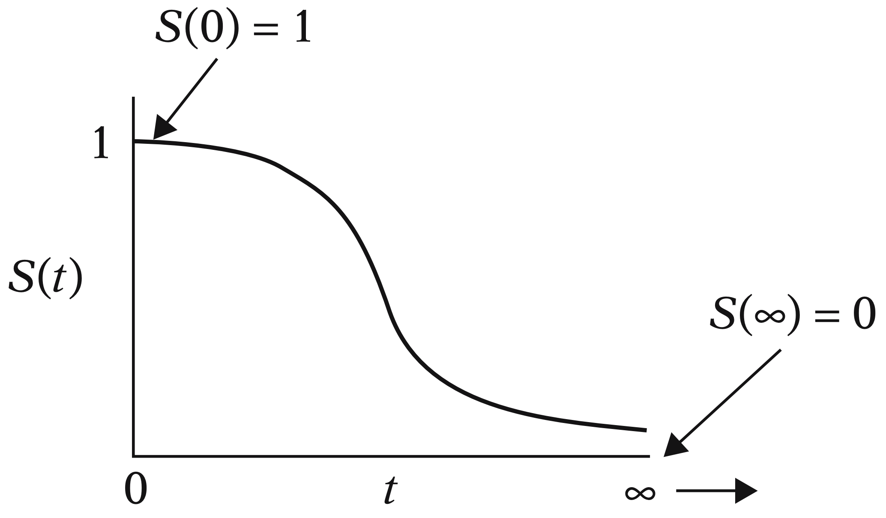

# Lecture 5: Survival Analysis

## Survival Analysis

- Continuous response variable (time to event)
  - e,g, time to death, time to failure, time to recovery
  - "survival" does not necessarily mean "alive", just means "not yet experienced the event"
- **Censoring**: some subjects do not experience the event during the study period
- Implications **not** taking censoring into account

  - Estimate uncertainty will be larger (compared to if we had complete data)
  - Biased estimates of survival probabilities

    ### Censoring Examples

    #### Constant Right Censoring

    - All subjects are followed for the same amount of time
      - We do not know what happens after the study period
    - e.g. 10 year study to see people die from cancer

    

    #### Random Right Censoring

    - Something happened (unrelated event) to the subject that caused them to leave the study
    - e.g. the person died from a car accident, or moved to another country when we are measuring cancer death

    #### Left Censoring

    - (not covered in this course)
    - We do not know when the event happened, only that it happened before the study period
    - e.g. study on kids learning to ski, one kid already knew how to ski before the study started but we don't know when they learned

### Key Concepts

#### Survival Function

V

- Probability that a subject survives beyond time $t$
- We do not model _Probability Distribution_ directly

Let $Y$: Time until event occurs

cdf:

$$ F_Y(t) = P(Y \leq t)$$

survival function:

$$ S_Y(t) = P(Y > t) = 1 - F_Y(t)$$

- _Note_: Can calulcate survival function $S_Y(t)$ from cdf $F_Y(t)$, so can obtain the survival function for **any positive random distribution**

##### Example of Survival Function



- Y: time until death (days)
- $S_Y(100) = 0.1$ means that the probability of surviving beyond 100 days is 0.1
- Survival funtion will always be **monotonically decreasing** as time goes on

###### Getting pdf from survival function

$$ f_Y(t) = \frac{d}{dt} F_Y(t) \\ = - \frac{d}{dt} S_Y(t)$$

#### Hazard Function

- **Instantaneous** rate of event occurance per unit time

$$ \lambda(t) = \lim\_{\Delta t \to 0} \frac{P(t \leq Y < t + \Delta t | Y \geq t)}{\Delta t} = \frac{f_Y(t)}{S_Y(t)}$$

#### Example: The Weibull Case

- Most popular _parametric_ survival model
  - Parametric models are GLMs with hazard function as the link function
- Weibull distribution is a continuous probability distribution
  - _heavy-tailed distribution_: has a higher probability of large values compared to a normal distribution

Let

$$Y \sim \text{Weibull}(\alpha, \beta)$$

**PDF:**

$$f_Y(t) = \frac{\alpha}{\beta^{\alpha}} t^{\alpha - 1} e^{-(t/\beta)^{\alpha}} \text{   for } t, \alpha, \beta > 0$$

- $\alpha$: shape parameter (controls the shape of the hazard function)
  - if $\alpha = 1$, it is the exponential distribution with parameter $\beta$
- $\beta$: scale parameter

  - does it stretch (large value) or shrink (small value) the distribution

**CDF:**

- recall cdf is the integral of the pdf: $F_Y(t) = \int_{0}^{t} f_Y(u) du$

$$F_Y(t) = 1 - e^{-(t/\beta)^{\alpha}}$$

**Survival function:**

$$S_Y(t) = e^{-(t/\beta)^{\alpha}}$$

##### Weibull in R

```R
pweibull(q = 2, shape = 1, scale = 1, lower.tail = FALSE) # survival probability

# get median
qweibull(p = 0.5, shape = 1, scale = 1, lower.tail = FALSE) # quantile
```

```

# get hazard function
weibull_hazard <- function(t, alpha, beta) {
  alpha * t^(alpha - 1) / beta^alpha
}

# Get the hazard function for data
fit_weibull <- survreg(Surv(time, event) ~ 1,
  data = data,
  dist = "weibull")

# get the estimated parameters
weibull_shape <- 1/ fit_weibull$scale # alpha
weibull_scale <- exp(fit_weibull$coefficients["(Intercept)"]) # beta
```

### Estimating Survival Function

- Parametric

  - assume a distribution
  - estimate parameters
  - estimate survival function
  - e.g. Weibull distribution

- **Kaplan-Meier Estimator**
  - non-parametric
  - does not assume any distribution
  - can handle censoring

#### `Surv` Function in R

- `Surv` function in R is used to create a survival object
  - `Surv(time, event)`: `time` is the time to event, `event` is a binary indicator of whether the event has occurred
  - `event = 0` means the event has not occurred, but the subject has been censored
  - `event = 1` means the event has occurred
  - _does not have to be 0 or 1, can be 1 or 2, or 0 or 2, etc as long as censored is the lower number_

#### Kaplan-Meier Estimator

```R
fit_km <- survfit(Surv(time, event) ~ 1,
  data = data)

# get survival function
tidy(fit_km)

# plot survival function, use ggfortify::autoplot
autoplot(fit_km)
```

- output of `tidy(fit_km)` are:
  - `time`: time
  - `n.risk`: number of subjects at risk at time `time` (before we record the event)
  - `n.event`: number of events at time `time`
  - `n.censor`: number of censored subjects at time `time`
  - `estimate`: proportion of subjects still alive at time `time`

#### Cox Proportional Hazards Model

$$\lambda(t|X_{i,1},...,X_{i,p}) = \lambda_0(t) e^{\beta_1 X_{i,1} + ... + \beta_p X_{i,p}}$$

- $\lambda_0(t)$: baseline hazard function

```R
fit_cox <- coxph(Surv(time, event) ~ var1 + var2,
  data = data)

# view the estimated coefficients
tidy(fit_cox, conf.int = TRUE)
```

##### Interpretation of Cox Model

- $\beta_j$ on the continous $j$th regressor: $\exp(\beta_j)$ is the multiplicative change in the hazard function for a one unit increase in $X_{i,j}$
