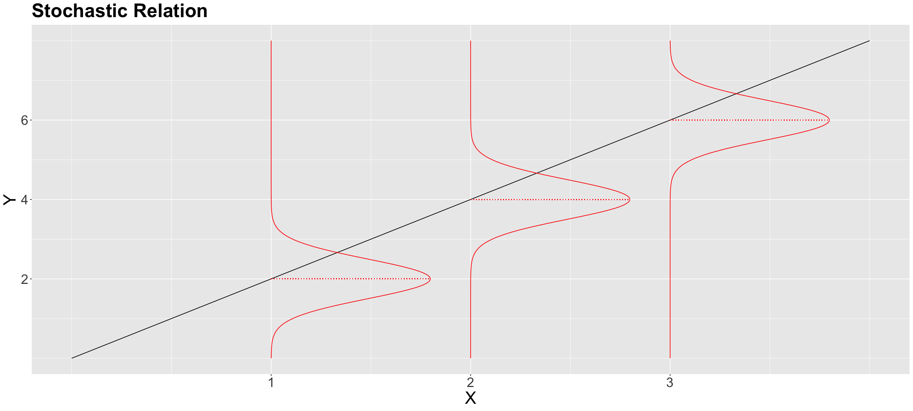

# Lecture 7: Quantile Regression

## Quantile Regression

### Quantile: Recap

- The **quantile** $Q(\tau)$ is the observed value of $X$ such that $\tau * 100\%$ of the data is less than or equal to $X$.
  - i.e. on the left side of the distribution

 

### Applications of Quantile Regression

- **Quantile regression** is a form of regression analysis used to estimate the conditional median or other quantiles of a response variable.

- Types of questions that can be answered with quantile regression:
  - For baseball teams in the upper 75% threshold in runs, are these runs largely associated with a large number of hits?
  - For any given team that scores 1000 hits in future tournaments, how many runs can this team score with 50% chance?

### Parametric Quantile Regression

- Recall **OLS**:
  $$
  \mathbb{E}(Y_i \mid X_{i,j} = x_{i,j}) = \beta_0 + \beta_1 x_{i,1} + \ldots + \beta_k x_{i,k};
  $$

$$
\text{loss} = \sum_{i = 1}^n (y_i - \beta_0 - \beta_1 x_{i,1} - \ldots - \beta_k x_{i,k})^2.
$$

- **Parametric Quantile Regression**:

$$
Q_i( \tau \mid X_{i,j} = x_{i,j}) = \beta_0(\tau) + \beta_1(\tau) x_{i,1} + \ldots + \beta_k(\tau) x_{i,k}
$$

_(notice the $\beta$s are now functions of $\tau$)_

$$
\text{loss} = \sum_{i} e_i[\tau - I(e_i < 0)] = \sum_{i: e_i \geq 0} \tau|e_i|+\sum_{i: e_i < 0}(1-\tau)|e_i|
$$

#### Estimation of Parametric Quantile Regression

```R
# Plotting the quantiles
ggplot(data, aes(x, y)) +
    geom_point() +
    geom_quantile(quantiles = c(0.25, 0.5, 0.75),
                    formula = y ~ x)

# fit the model
pqr_model <- rq(y ~ x,
                tau = c(0.25, 0.5, 0.75),
                data = data)
```

#### Inferece of Parametric Quantile Regression

- To justify the relationship b/w the $\tau$th quantile in response and regressors.

- Use test statistics to test the null hypothesis that the $\tau$th quantile is not related to the regressors.
  - $t$-value with $n - k - 1$ degrees of freedom:

$$t_j = \frac{\hat{\beta}_j(\tau)}{\text{SE}(\hat{\beta}_j(\tau))}$$

- Null hypothesis: $H_0 : \beta_j(\tau) = 0$.

- Check p-value: `summary(pqr_model)[1]` for $\tau = 0.25$, `summary(pqr_model)[2]` for $\tau = 0.5$, `summary(pqr_model)[3]` for $\tau = 0.75$.

#### Coefficient Interpretation

- Similar to OLS
- $\beta_1(\tau)$ is the change in the $\tau$th quantile of $Y$ for a unit increase in $X_1$.
- e.g. $\beta_1(0.75) = 0.5$ means that for a unit increase in $X_1$, the 75th quantile of $Y$ increases by 0.5.

#### Prediction

```R
predict(pqr_model, newdata = data.frame(...))
```

### Nonparametric Quantile Regression

- Implicates no distributional assumptions and no model function specification.
- $\lambda$ is the penalty parameter.
  - Choosing **how local** the estimation is.
  - small $\lambda$: better approx, but more variance (model not smooth)
  - large $\lambda$: lose local info, favouring smoothness (global info)

```R
median_rqss <- rqss(y ~ qss(x, lambda = 0.5),
            tau = 0.5, # cannot do multiple quantiles
            data = data)

summary(median_rqss)

predict(median_rqss, newdata = data.frame(...))
```
